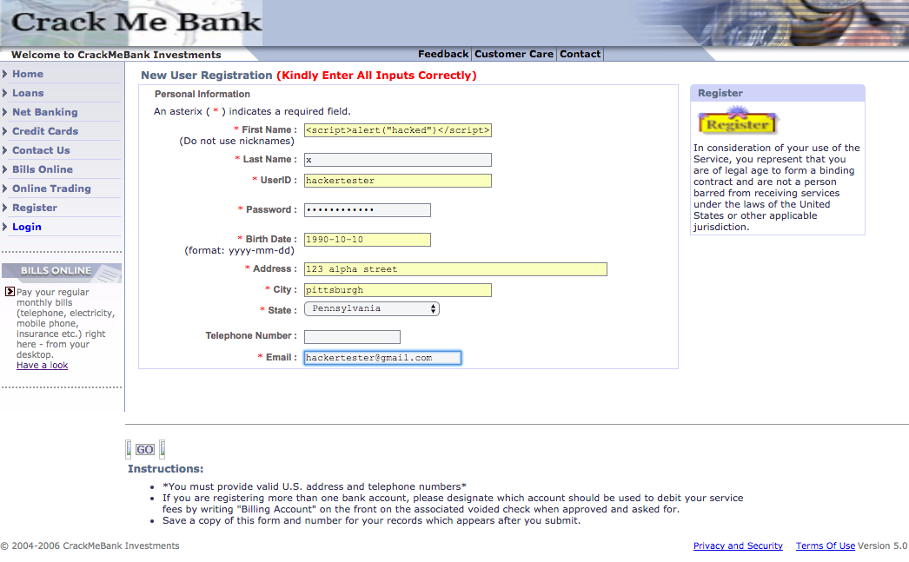

# Deliverable 5

## Vulnerability 1: Injection
  
### Analysis

This vulnerability attack confidentiality and integrity. Modification active attack can exploit this vulnerability. This vulnerability may lead to data loss, unauthorized login, unauthorized actions to database. Use ADO Command Objects with strong type checking and parameterized queries may minimize this impac.

URL:[http://demo.testfire.net/bank/login.aspx](http://demo.testfire.net/bank/login.aspx)

### Reproduce & Observation

1. Enter website
2. Locate username input
3. Enter "[ZAP' OR '1'='1' -- ]"
4. Locate password input
5. Enter any string value

    

6. Click "Login"

    

## Vulnerability 2: Injection

### Analysis

This vulnerability attack confidentiality. Modification active attack can exploit this vulnerability. This vulnerability may lead to unexpected infomation exposure.

To avoid database injection attack, developers should use parameterized queries, escape all user supplied input, and enable leaset access for database user.

### Observation

We found the database injection vulnerability at [Web Scanner Test Site](http://www.webscantest.com/datastore/search_by_id.php). The page is designed to present one item for each query. However, given designed query, it present all records in the database.

The result with query statement: `1 OR TRUE`:
    

### Reproduce

1. Open the [page](http://www.webscantest.com/datastore/search_by_id.php);
2. Fill the text box with `1 OR TRUE`;
3. Click "search" button.

## Vulnerability 3: Injection & Security Misconfiguration

### Analysis

This vulnerability attack confidentiality, integrity, availability. Interception and interruption active attack can exploit this vulnerability. This Vulnerability may lead to data loss, unauthorized access to server operating system. On the one hand, whitelists that limit the character set based on the expected value of the parameter is required when constructing OS command strings. This will indirectly limit the scope of an attack, but this technique is less important than proper output encoding and escaping. On the other hand, appropriate access control should be configured on the server to ensure resources can only be accessed by expected users.

URL:[http://www.webscantest.com/](http://www.webscantest.com/)

### Reproduce & Observation

1. Enter website
2. Locate "domain" input element
3. Enter "[ZAP&cat /etc/passwd&]"
    
    

4. Click "Lookup"

    

## Vulnerability 4: XSS

### Analysis

This vulnerability itself attacks availability since user may not be able to access expected information due to the xss attack. It can also attack the other two, i.e. confidentiality and integrity by combining other techniques. Exploiting this vulnerability is a active attack. It may bring different losses, such as injecting inappropriate content to home page, altering normal business logic which can cause various problems.

To avoid xss attack, developers should ensure there's no untrested data within the page context, scripts, stylesheets, and so on.

### Observation

We found the Cross-site Scripting vulnerability at [Crack Me Bank](http://crackme.cenzic.com/kelev/register/register.php). When scripts injected as a user name, it would be stored into database on server and executed when the piece of code been retrieved from database. 

A new user is register with script-injected user name: ``
   

When the page is redirected to user's home page, the injected script is executed.
   

Comparing the home page of user with valid first name and the injected first name, we can see that the first name of the latter one is missing.
    

### Reproduce

1. Loading to the [sign on page](http://crackme.cenzic.com/kelev/register/register.php);
2. Fill first name with ``;
3. Fill other required fields;
4. Click 'Go' on the left bottom corner.

